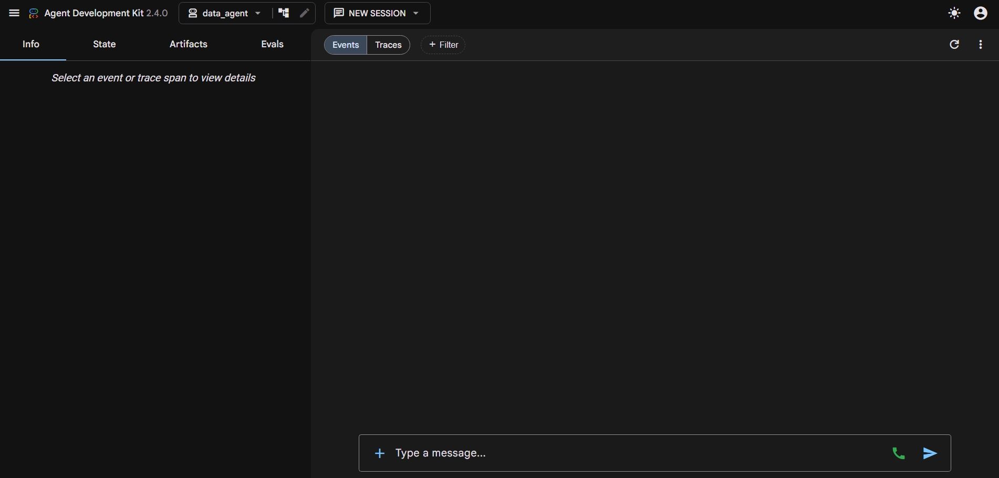

# 📍 Optimize Shop Placement

A **Google ADK** data-analysis agent that answers natural-language questions about where to place a shop by directly querying **BigQuery's public NYC Citi Bike dataset** — trip volumes, station locations, and ridership patterns — through Google's managed **BigQuery MCP Server**.

Instead of hand-writing SQL, you ask the agent a question (e.g. *"Which stations have the highest evening dropoff volume?"*) and it inspects the schema, writes and dry-run validates its own SQL, executes it read-only, and returns a data-grounded answer.

**🔗 Live demo (ADK Dev UI):** [bq-data-agent-545646377190.us-central1.run.app/dev-ui/?app=data_agent](https://bq-data-agent-545646377190.us-central1.run.app/dev-ui/?app=data_agent)



## Features

- 🤖 Conversational data agent built on Google ADK's `LlmAgent`
- 🚲 Queries the public `bigquery-public-data.new_york_citibike` dataset (NYC Citi Bike trips & stations)
- 🔌 Connects to BigQuery via the hosted **BigQuery MCP Server** (`McpToolset` + `StreamableHTTPConnectionParams`) instead of a local client library
- 🔐 Authenticates using the caller's own **Application Default Credentials** — no service account keys or secrets stored in the repo
- 🛡️ Restricted to **read-only** tools (`get_dataset_info`, `list_table_ids`, `get_table_info`, `execute_sql_readonly`) so the agent can never modify data
- 🧠 Instructed to always inspect real schema/values first rather than assume column names, types, or joins
- ✅ Dry-runs every query before execution to catch SQL errors early

## Tech Stack

| Layer | Technology |
|---|---|
| Agent framework | [Google ADK](https://google.github.io/adk-docs/) (`LlmAgent`) |
| LLM | Gemini (`gemini-3.6-flash`) |
| Data source | BigQuery public dataset — `bigquery-public-data.new_york_citibike` |
| Data access | [BigQuery MCP Server](https://bigquery.googleapis.com/mcp) via `McpToolset` |
| Auth | Google Application Default Credentials (ADC) |

## How It Works

1. **`env.sh`** sets the Google Cloud project, region, and Gemini/Agent Platform environment variables the agent needs at runtime.
2. **`agent.py`**:
   - Loads Application Default Credentials and refreshes them to build a Bearer auth header for every MCP request.
   - Registers an `McpToolset` pointed at Google's hosted BigQuery MCP endpoint, filtered down to four read-only tools.
   - Defines `root_agent`, an ADK `LlmAgent` whose system instruction enforces a strict plan: inspect the dataset schema and real column values first, never assume structure from prior knowledge, formulate a query plan, dry-run the SQL, then execute it read-only.
3. **`__init__.py`** exposes the `agent` module so the ADK CLI/runtime can discover `root_agent`.

```
User question → ADK Runner → root_agent (Gemini)
                                   │
                                   ▼
                        McpToolset ──► BigQuery MCP Server ──► bigquery-public-data.new_york_citibike
                        (ADC-authenticated, read-only)
                                   │
                                   ▼
                     Schema inspection → SQL dry-run → execute_sql_readonly
                                   │
                                   ▼
                        Data-grounded Markdown answer
```

## Project Structure

```
optimize-shop-placement/
├── data_agent/
│   ├── __init__.py         # Exposes the agent module to the ADK runtime
│   ├── agent.py            # LlmAgent + BigQuery MCP toolset definition
│   └── requirements.txt    # Agent-specific dependencies
├── env.sh                  # Cloud project/region + Gemini env var setup
└── .gitignore
```

## Getting Started

### Prerequisites

- Python 3.10+
- A Google Cloud project with the **BigQuery API** enabled
- Application Default Credentials configured locally:
  ```bash
  gcloud auth application-default login
  ```
- Your account/ADC identity needs BigQuery read access (e.g. `roles/bigquery.dataViewer` and `roles/bigquery.jobUser`) since the agent authenticates as *you*, not a service account

### 1. Clone the repo

```bash
git clone https://github.com/Codsach/optimize-shop-placement.git
cd optimize-shop-placement
```

### 2. Install dependencies

```bash
python -m venv venv
source venv/bin/activate   # Windows: venv\Scripts\activate
pip install -r data_agent/requirements.txt
```

### 3. Configure environment variables

```bash
source env.sh
```

This sets `GOOGLE_CLOUD_PROJECT`, `GOOGLE_CLOUD_REGION`, and the Gemini Agent Platform variables (`GOOGLE_GENAI_USE_ENTERPRISE`, `GOOGLE_CLOUD_LOCATION`).

### 4. Run the agent

```bash
adk run data_agent
```

Or launch the ADK Dev UI for a browser-based chat interface (same UI as the live demo above):

```bash
adk web
```

### Deployment

The live demo runs on **Google Cloud Run** in `us-central1`, serving the ADK Dev UI directly. To deploy your own copy:

```bash
adk deploy cloud_run \
  --project=$GOOGLE_CLOUD_PROJECT \
  --region=$GOOGLE_CLOUD_REGION \
  --service_name=bq-data-agent \
  --with_ui \
  data_agent
```

## Example Questions

- *"What are the busiest Citi Bike stations by trip volume?"*
- *"Which areas see the highest bike traffic during evening commute hours?"*
- *"Compare weekday vs weekend ridership by station."*

The agent will inspect the dataset's actual schema and values before writing any SQL, so answers are grounded in the real data rather than assumptions.

## License

No license specified yet — add one (e.g. MIT) if you intend this to be open source.

## Author

Built by [Sachin R](https://github.com/Codsach) — [Portfolio](https://sachinr.vercel.app) · [LinkedIn](https://linkedin.com/in/sachin-r-b737a7393)
